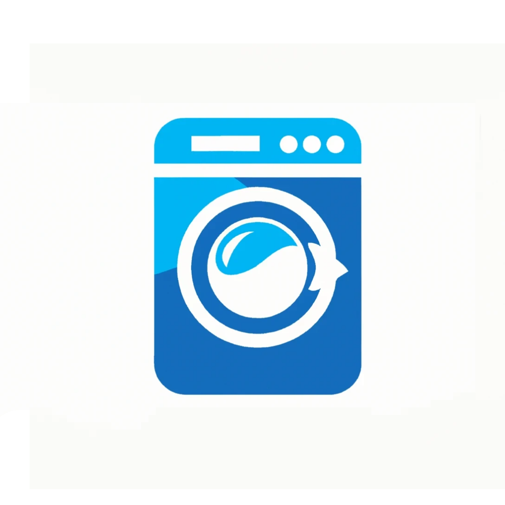

# Smart Dhobi

Smart Dhobi is a laundry management app built on Flutter and Appwrite, which helps users help with laundry day which can be quite a tedious task for most people, which also helps the laundry service managers manage their daily laundry intake in batches.

## Getting Started with Flutter

This project is a starting point for a Flutter application.

A few resources to get you started if this is your first Flutter project:

- [Lab: Write your first Flutter app](https://docs.flutter.dev/get-started/codelab)
- [Cookbook: Useful Flutter samples](https://docs.flutter.dev/cookbook)

For help getting started with Flutter development, view the
[online documentation](https://docs.flutter.dev/), which offers tutorials,
samples, guidance on mobile development, and a full API reference.

## Getting Started with Appwrite

- Install Appwrite using Docker. Get instructions on [Appwrite](https://appwrite.io/)
- Create a new project
- Configure the project according to the given credentials to work out of the box or you can always edit the keys in lib/constants.dart.

- Create and configure the following databases

